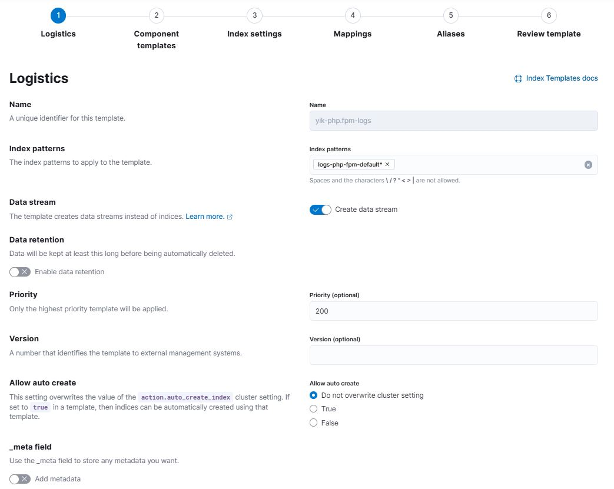

# Мониторинг с помощью Prometheus

## Задача

Настроить сбор логов, метрик и показателей доступности с компонентов CMS и ВМ с спользованием filebeat, metricbeat, heartbeat. Собранные данные требуется напрямую отправлять в Elasticsearch и визуализировать в Kibana.

## Решение
Для решения задачи filebeat и metricbeat установлены на хосте с CMS, а Elasticsearch, Kibana и heartbeat установлены на другом хосте. Использованы дата-стримы, созданы ILM-политики для хранения логов php-fpm в течение 14 дней, а логов nginx и mysql - в течение 30 дней. Для access-логов nginx использована опция dissect. Heartbeat проверяет CMS по http и порт БД по tcp. Все данные выведены в дата-вью в раздел Discover.

##### 1. Шаблоны и политики
Для логов созданы отдельные шаблоны и политики под каждый компонент. Под метрики созданы отдельные шаблоны и политики под каждый компонент. Для мониторов использован один шаблон и одна политика (с хранением не более 14 дней). Ниже - пример политики и шаблона:

##### 2. Filebeat
Конфигурационный файл приложен. Ниже - срины дата-стримов, индексов, дата-вью:

##### 3. Metricbeat
Конфигурационный фалй приложен. Ниже - скрины дата-стримов, индексов, дата-вью:

##### 4. Heartbeat
Конфигурационный файл приложен. Ниже - скрины дата-стримов, индексов, дата-вью:

