# Мониторинг с помощью ELK (Vector).

## Задача

Настроить сбор логов с компонентов CMS с помощью Filebeat. Собранные данные требуется в сыром виде отправлять в Logstahs/Vector для последующий обработки и отправки в Elasticsearch. Визуализировать данные в Kibana.

## Решение
Для решения задачи filebeat установлен на хосте с CMS, а Elasticsearch, Kibana, Logstash/Vector установлены на другом хосте. Использованы дата-стримы, созданы ILM-политики и шаблоны по аналогии с предыдущей задачей. Для access-логов nginx использован VRL-фильтр. Конфигурационный файл filebeat.yml видоизменен. Все конфигуарционные файлы приложены.

##### Vector
Vector сконфигурирован для сбора и парсинга логов, по аналогии с предыдущей задачей парсинг настроен только для логов nginx access. Ниже - скрипншоты с политик и шаблонов (на примере mysql), сформированных дата-стримов и индексов, дата-вью:

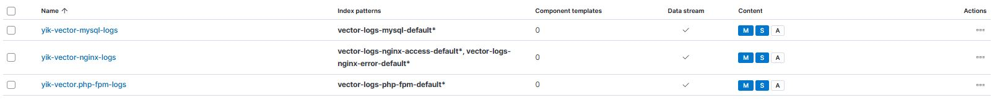
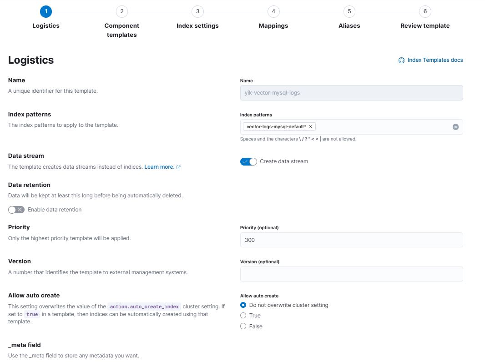

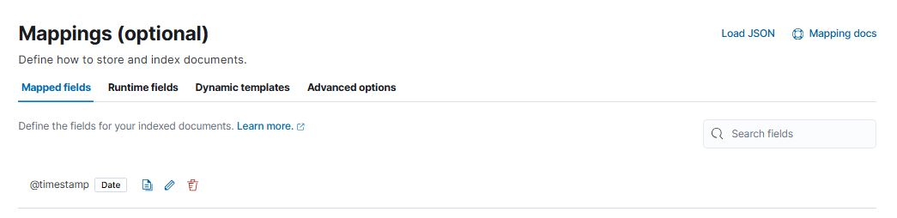
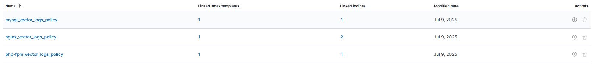
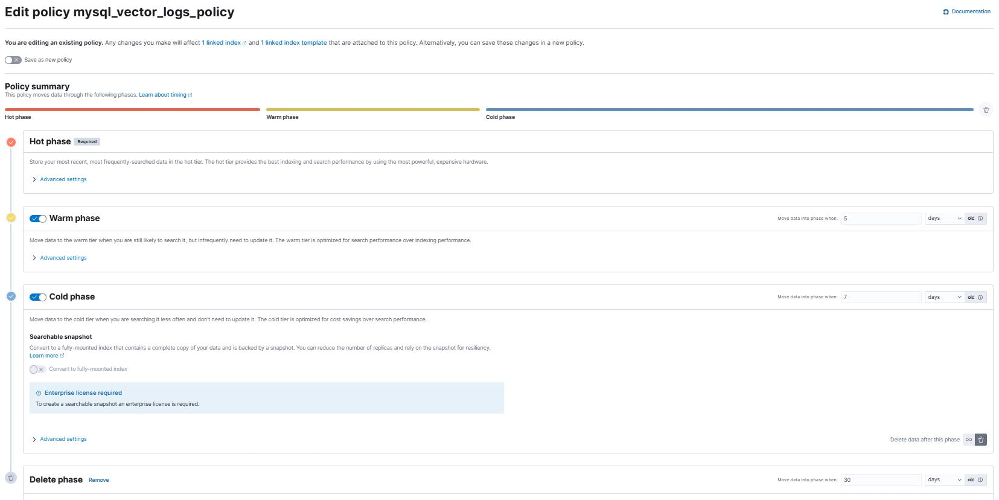
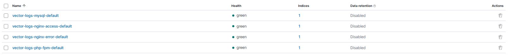
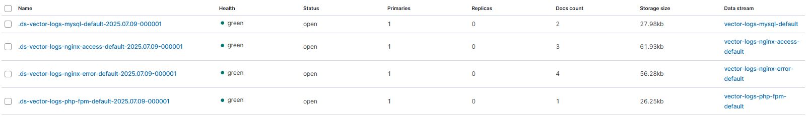
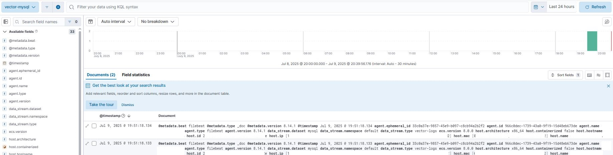
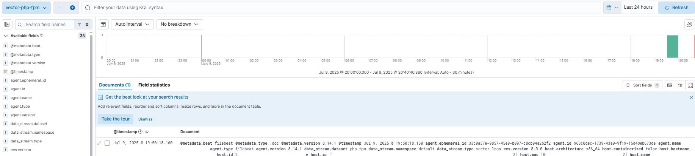
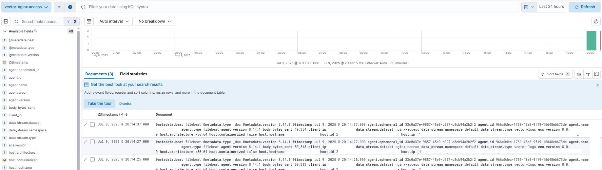
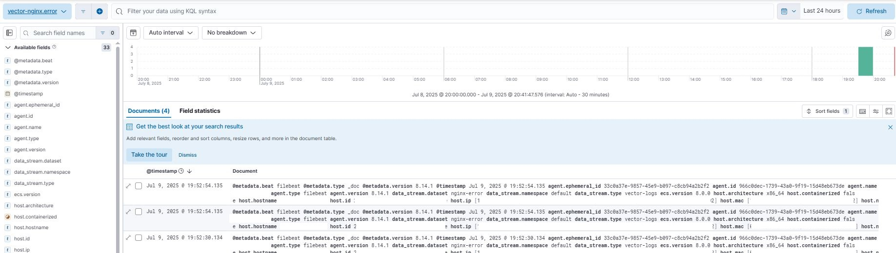

