# Мониторинг с помощью Prometheus

## Задача

Настроить сбор метрик с помощью Prometheus на примере мониторинга CMS. Задействовать максимальное количество экспортеров для мониторинга состояния компонентов системы. Настроить доступ к экспортерам по одному порту с использованием SSL и авторизации.

## Решение
Для решения задачи использован способ установки компонентов мониторинга через unit-файлы systemd. В целях обучения использован не самый безопасный, но простой способ указания данных для авторизации (креды указаны в конфиге в явном виде).

### Использованные элементы
| Элемент | Назначение |
| ------ | ------ |
| [Prometheus](https://github.com/prometheus/prometheus/releases/download/v2.53.4/prometheus-2.53.4.linux-amd64.tar.gz) | сервер мониторинга |
| [Node exporter](https://github.com/prometheus/node_exporter/releases/download/v1.9.1/node_exporter-1.9.1.linux-amd64.tar.gz) | экспортер метрик ВМ |
| [Blackbox exporter](https://github.com/prometheus/blackbox_exporter/releases/download/v0.26.0/blackbox_exporter-0.26.0.linux-amd64.tar.gz) | экспортер для проверок по HTTP (в рамках данной задачи) |
| [MySQL Exporter](https://github.com/prometheus/mysqld_exporter/releases/download/v0.17.2/mysqld_exporter-0.17.2.linux-amd64.tar.gz) | экспортер метрик БД |
| [PHP-FPM exporter](https://github.com/bakins/php-fpm-exporter/releases/download/v0.6.1/php-fpm-exporter.linux.amd64) | экспортер метрик php-fpm |
| [Nginx exporter](https://github.com/nginx/nginx-prometheus-exporter/releases/download/v1.4.1/nginx-prometheus-exporter_1.4.1_linux_amd64.tar.gz) | экспорте метрик nginx |
| [Wordpress](http://wordpress.org/latest.tar.gz) | CMS |
| [PromPress](https://downloads.wordpress.org/plugin/prompress.1.2.2.zip) | плагин для сбора метрик Wordpress |
| Redis | СУБД для работы PromPress |
| LEMP | стек для развертывания Wordpress |

##### 1. Установка Prometheus
Prometheus установлен на отдельной машине, в конфиг добавлена джоба для сбора данных с самого Prometheus. Конфигурационный файл с настройками приложен.

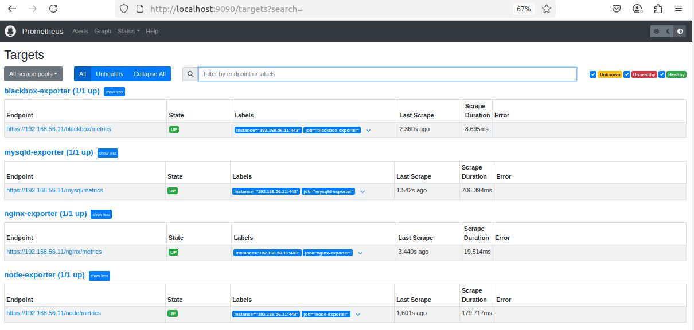
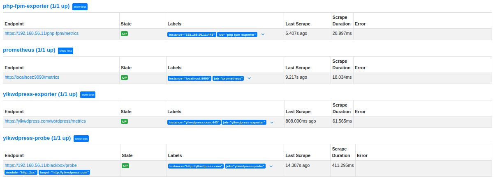

##### 2. Установка Wordpress
Установлена последняя версия Wordpress, также установлен плагин для сбора метрик для Prometheus.

##### 3. Установка экспортеров
Установлены указанные в таблице выше экспортеры.

###### Node exporter
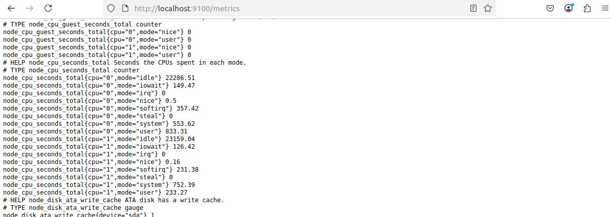

###### MySQL exporter
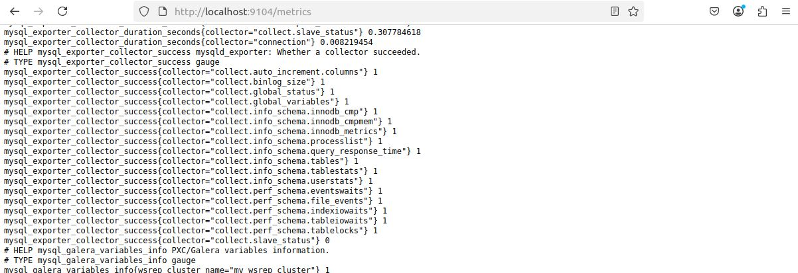

###### Blackbox exporter
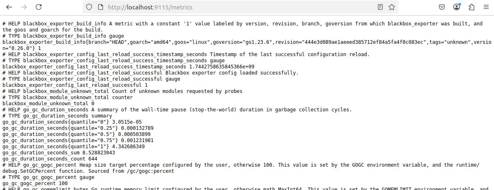

###### Blackbox probe
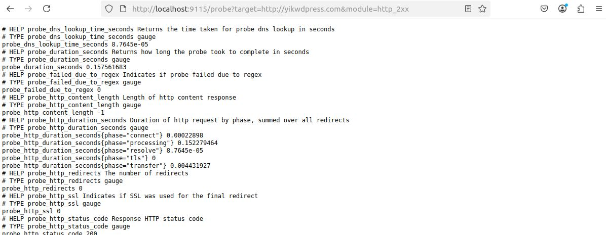

###### PromPress plugin
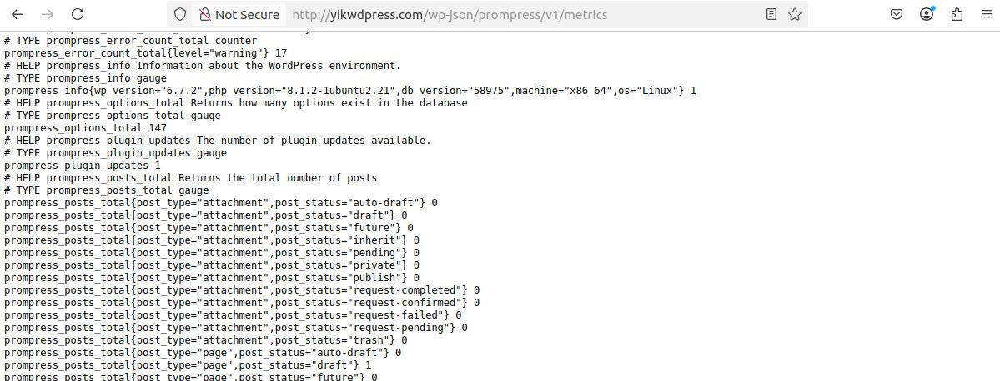

###### Nginx exporter
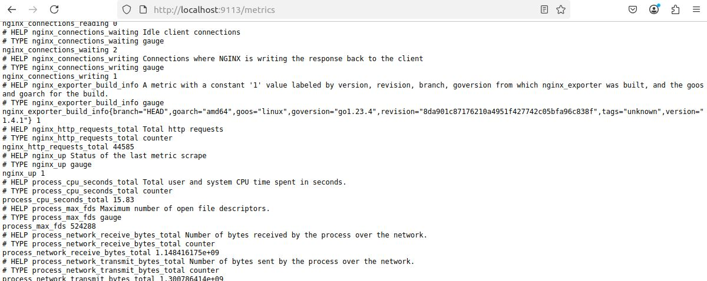

###### PHP-FPM exporter
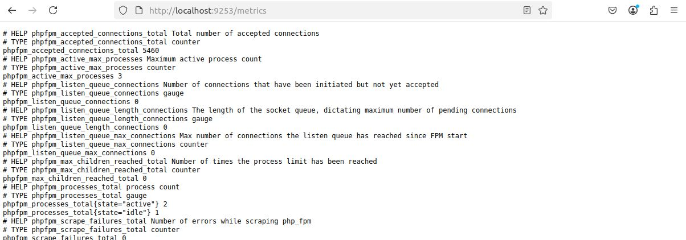

##### 4. Настройка прокси
Nginx проксирует запросы к страницам с метриками на IP:443. Конфигурационный файл с настройками прокси с использованием SSL и авторизации приложен.

##### 5. Ограничение доступа к порту 443 с помощью iptables
Директивы iptables, где 192.168.56.10 - адрес Prometheus, 192.168.56.11 - адрес CMS:
```sh
iptables -A INPUT -p tcp -s 192.168.56.10 --dport 443 -d 192.168.56.11 -j ACCEPT
iptables -A INPUT -p tcp --dport 443 -j DROP
```

# ДОПОЛНЕНИЕ: настройка уведомлений через Alertmanager

## Задача
Настроить отправку уведомлений в Telegram таким образом, чтобы алерты с разными уровнями критичности падали в разные каналы: critical - в один, warning и другое - в другой.

## Решение
Задача выполнена на примере трех алертов с разными условиями и, соответственно, разными уровнями критичности по одной и той же проблеме - загрузка CPU.
Конфигурационный файл alertmanager.yml, файл с правилами rules.yml и шаблон сообщения telegram.tmpl приложены. В конфигурационный файл prometheus.yml внесены изменения: раскомментированы блоки для подключения Alertmanager и файлов с рулами.

##### Результат тестирования
Созданы телеграм-бот и два канала. В канал 24x7 всегда падают все алерты, в канал 5x2 падают все алерты в рабочее время и только критические алерты в нерабочее время. При этом, если по CPU срабатывает алерт уровня critical, warning-и подавляются и не рассылаются.

###### Примеры алертов в канале 5x2


###### Примеры алертов в канале 24x7
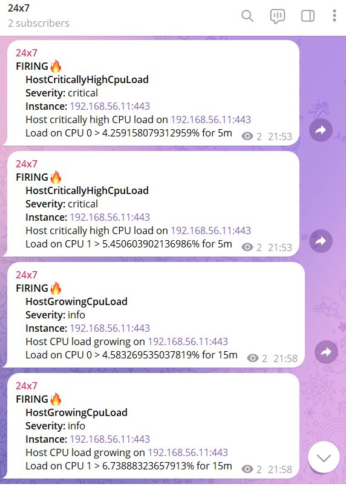
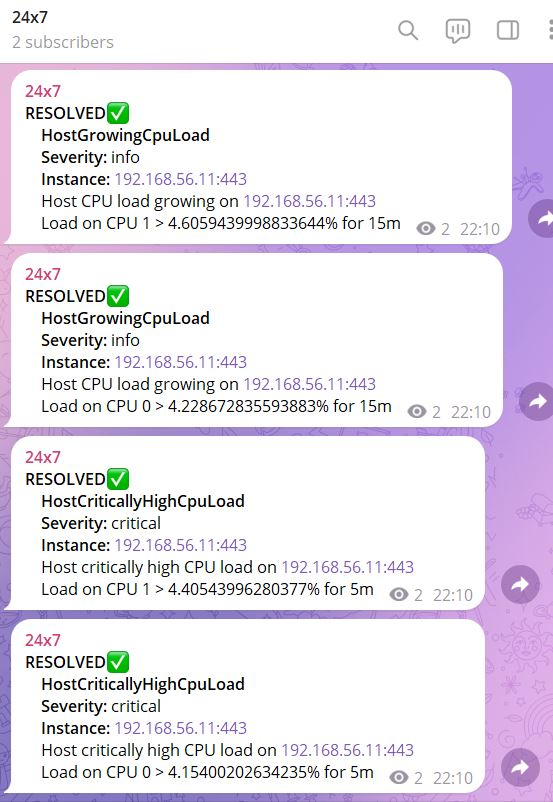

# ДОПОЛНЕНИЕ: Работа с Grafana

## Задача
Требуется создать папки для дашбордов по инфраструктуре и метрикам приложения. Также требуется создать более детальный дашборд по инфраструктуре для линковки с первоначальным сводным шаблоном. Дополнительно требуется настроить алертинг из Grafana.

## Решение

##### Работа с дашбордами
Всего создано три дашборда:
* Infrastructure dashboard - сводный дашборд по инфраструктуре. К каждой панели блока Core metrics добавлена ссылка на соответствующую панель на дашборде Infrastructure in detail, чтобы при переходе по ссылке открывался не весь дашборд, а сразу конкретная панель в режиме View.
* Infrastructure in detail - детальный дашборд с инфраструктурными метриками.
* Wordpress - дашборд с некоторыми метриками Wordpress.

##### Скриншоты с дашбордов

###### Общий вид дашбордов

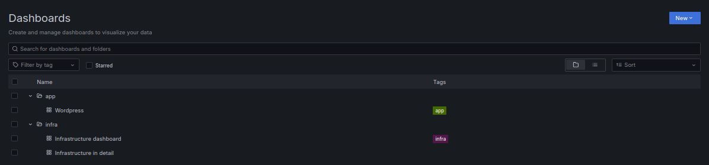

###### Общий вид дашборда Infrastructure dashboard

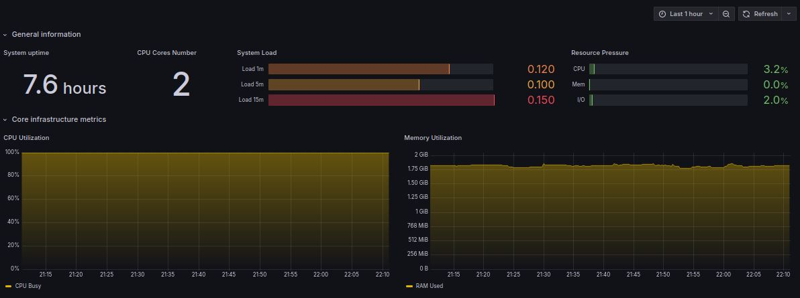
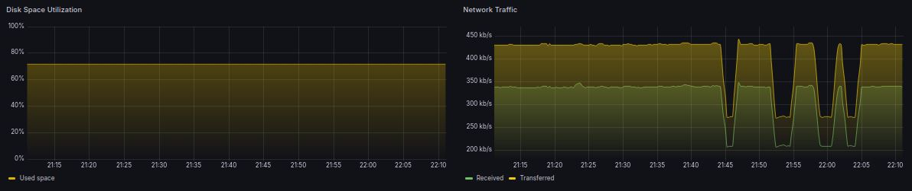

###### Оформление ссылки для drilldown на панели в Infrastructure dashboard

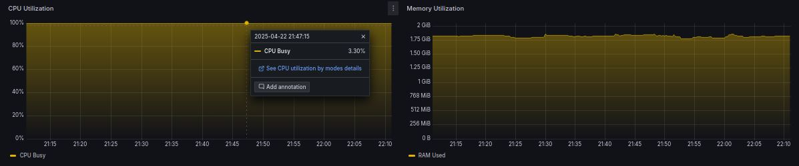
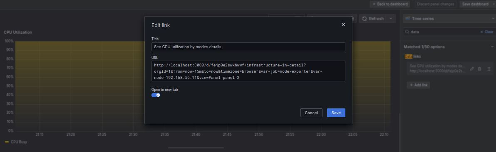

###### Общий вид дашборда Infrastructure in detail

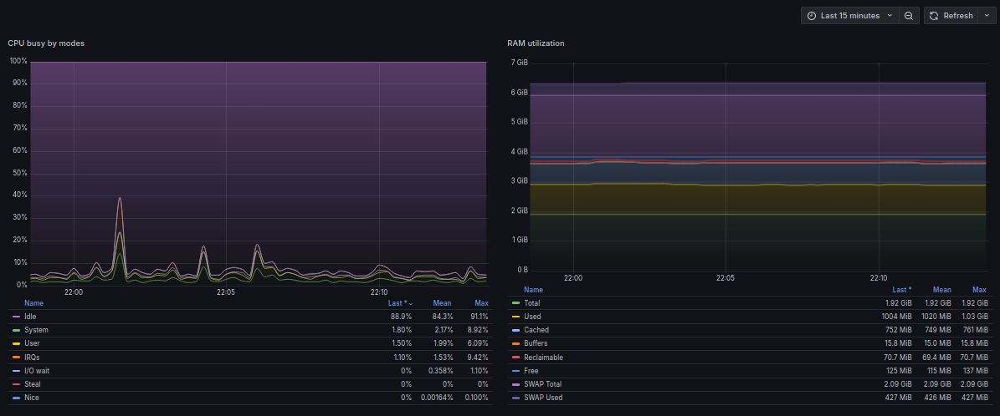
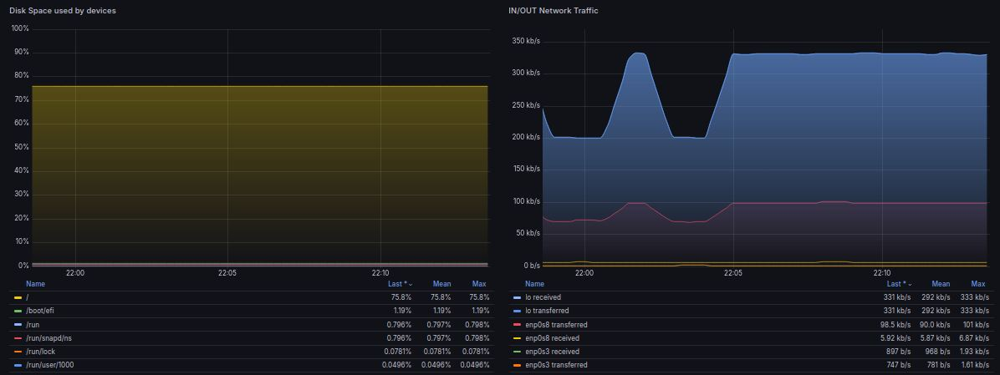

###### Общий вид дашборда Wordpress

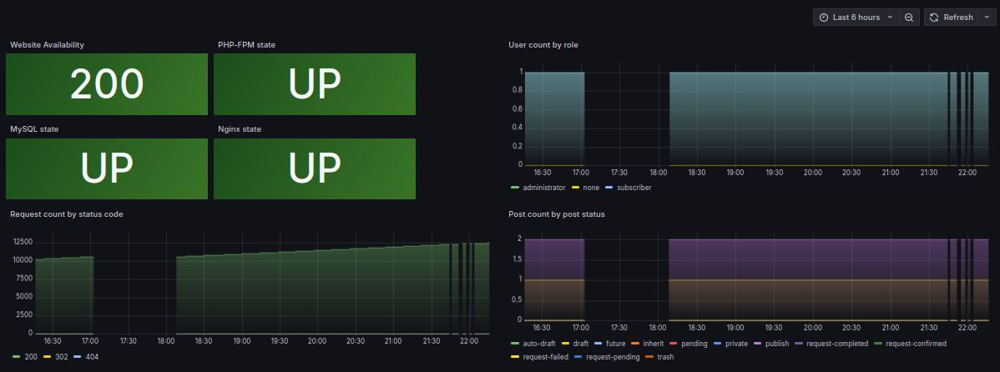

##### Настройка алертинга
Для сообщения использован кастомный темплейт, сделанный для Alertmanager в рамках предыдущего задания.

###### Правило и результат срабатывания

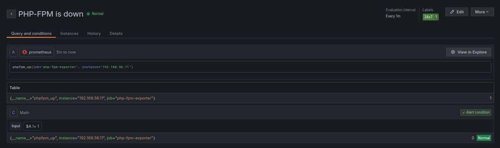

