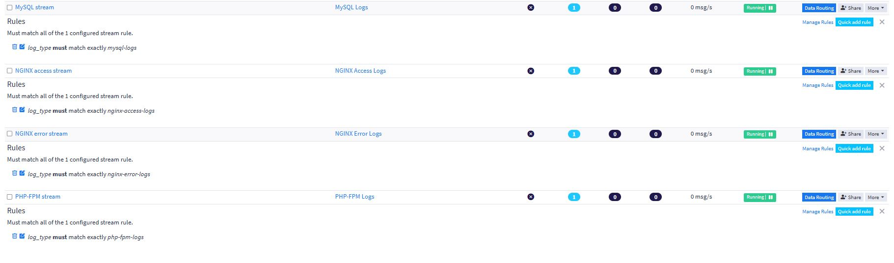
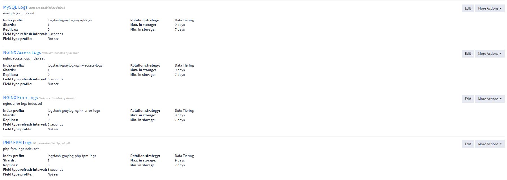
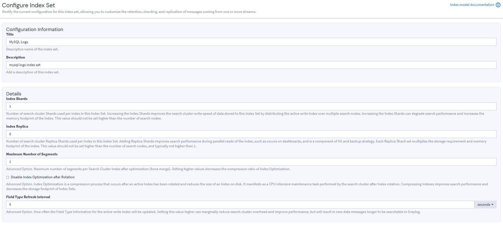
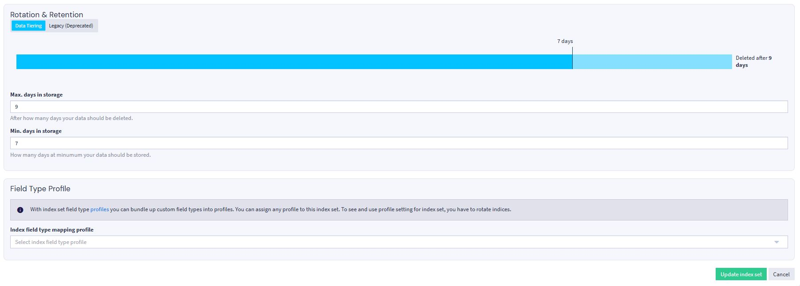
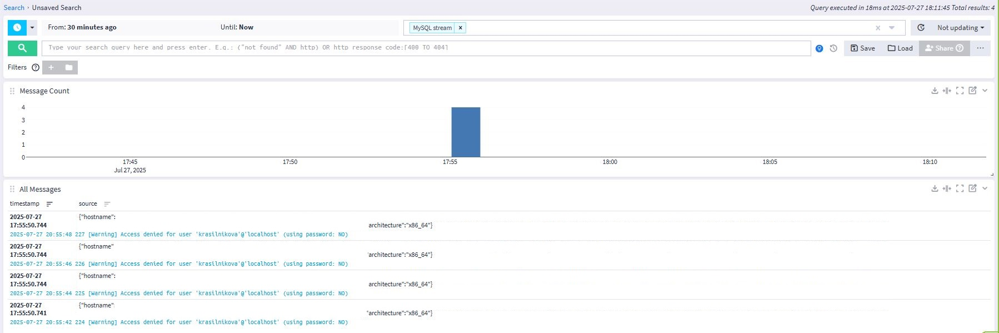
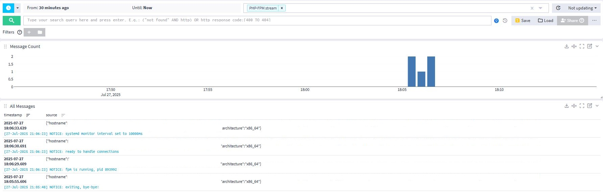
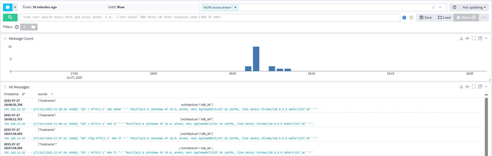
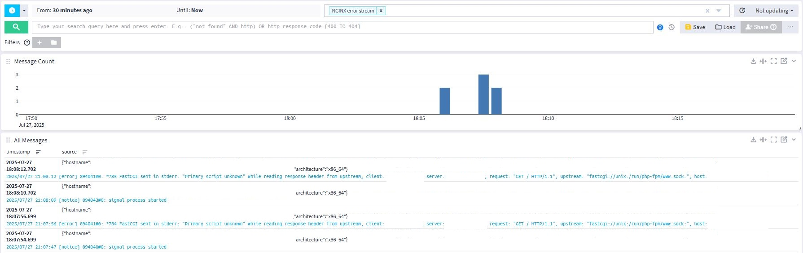

# Мониторинг с помощью Graylog.

## Задача

Настроить сбор логов с компонентов CMS с помощью Filebeat, управляемого через Graylog Sidecar. Собранные данные требуется в сыром виде отправлять в Logstash для последующий обработки, далее отправлять их в Graylog, где на основе созданных стримов и индекс-сетов данные будут попадать в определенные для каждого сервиса индексы.

## Решение
Для решения задачи filebeat и graylog sidecar установлены на хосте с CMS, а Opensearch, Graylog server, Logstash установлены на другом хосте. Graylog маршрутизирует логи в индексы по значениям поля "log_type". Конфигуарционные файлы пайплайна Logstash, кофига filebeat sidecar и самого sidecar приложены.

##### Визуализованные данные
Ниже - скрипншоты со стримов и индекс-сетов (подробнее - на примере mysql), обнаруженного sidecar, а также полученных данных:

