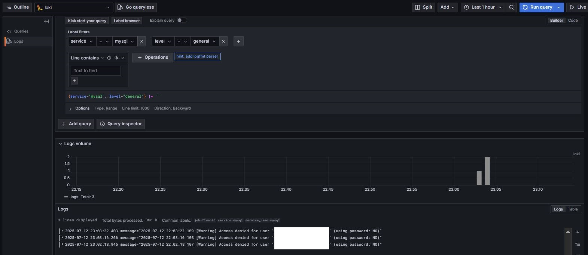
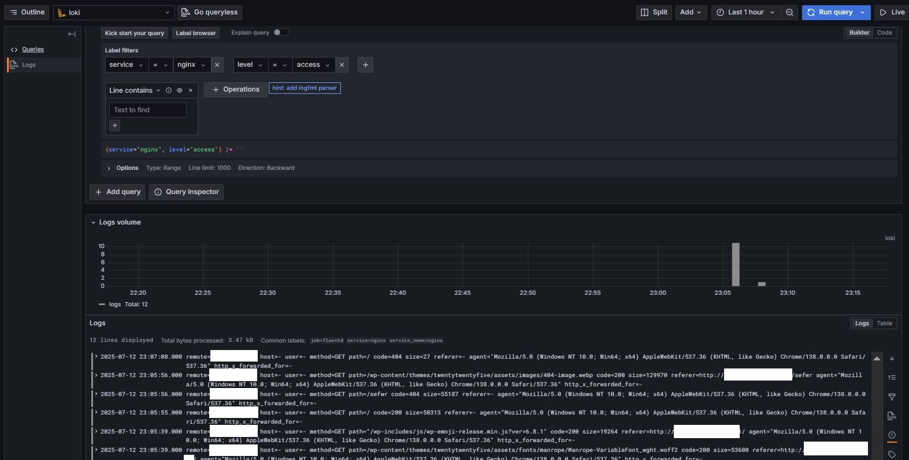
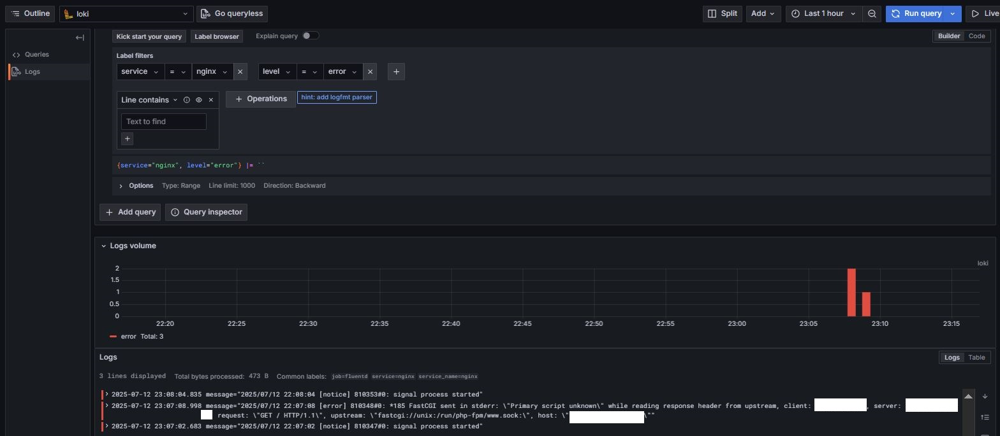
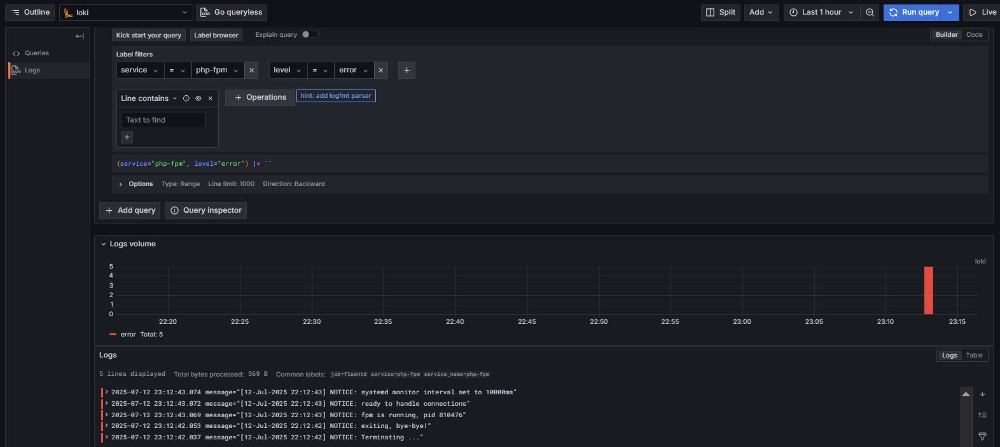

# Мониторинг с Loki.

## Задача

Настроить поступление логов в Grafana Loki. Использовать Grafana для визуализации.

## Решение
Для решения задачи на хосте с компонентами CMS установлен Fluentd, на отдельном хосте установлены Grafana и Grafana Loki. Конфигурационные файлы Fluentd и Grafana Loki приложены.

##### Loki
Ниже - скриншоты с полученных и визуализированных в Grafana данных:

