# Мониторинг с помощью OpenSearch

## Задача

Настроить сбор логов с компонентов CMS с спользованием Fluent Bit. Собранные данные требуется отправлять в Data Prepper, парсить логи nginx access, а затем направлять данные в разные data strems в OpenSearch и визуализировать в OpenSearch Dashboards. Дополнительно требуется настроить политики ISM.

## Решение
Для решения задачи Fluent Bit установлен на хосте с CMS, а OpenSearch, OpenSearch Dashboards и Data Prepper установлены на другом хосте. Использованы дата-стримы, созданы ISM-политики для хранения логов php-fpm в течение 14 дней, а логов nginx и mysql - в течение 30 дней. Для access-логов nginx использована grok. Все данные выведены в индекс-паттерны в раздел Discover. Кофигурационные файлы Fluent Bit и Data prepper приложены.

##### Получение данных в OpenSearch
Ниже - скрины созданные шаблонов и политик (подробнее - на примере mysql), дата-стримов, сформированных индексов и полученных данных, выведенных в Discover:

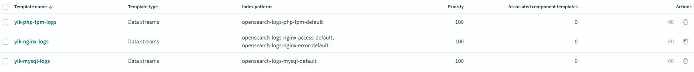
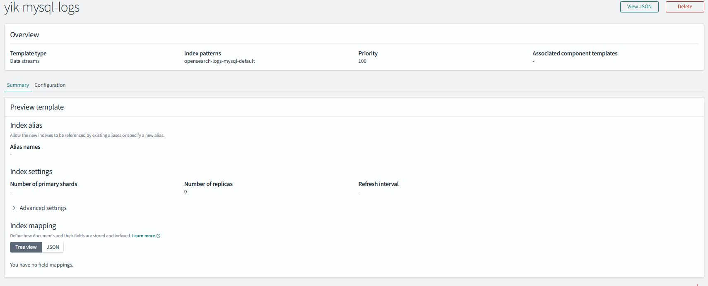
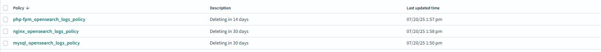
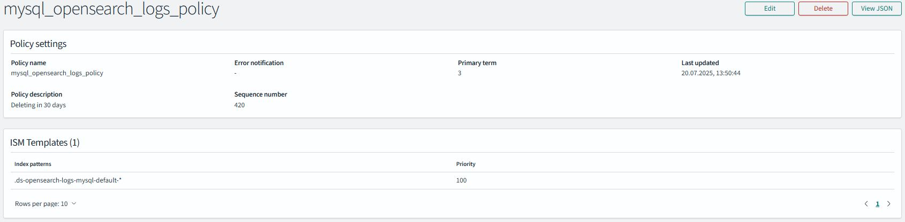
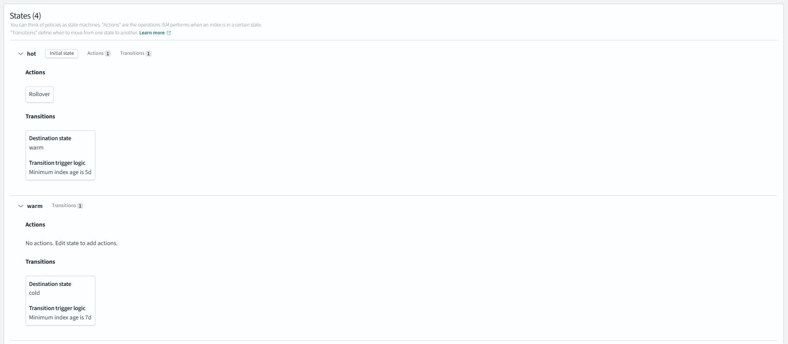
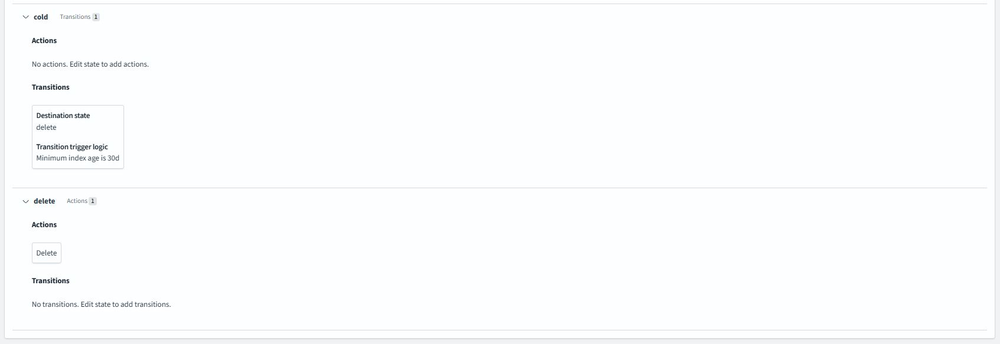
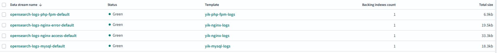
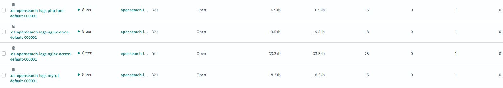
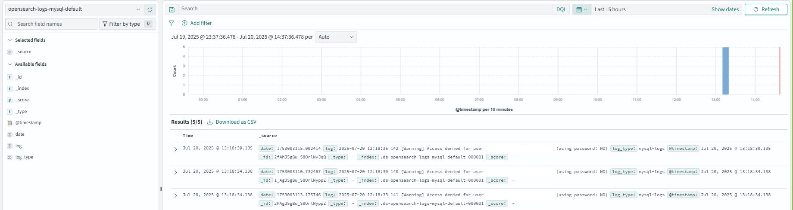
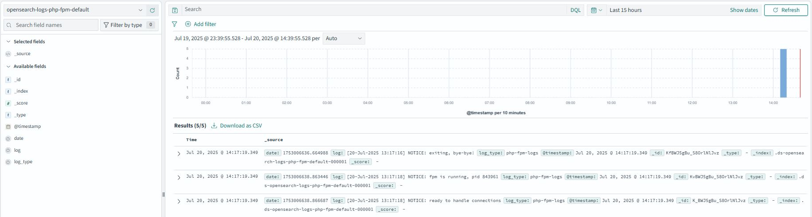
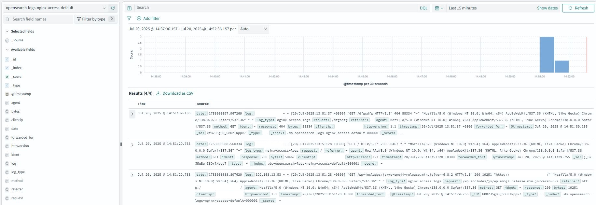
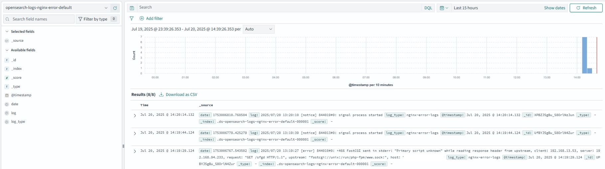
