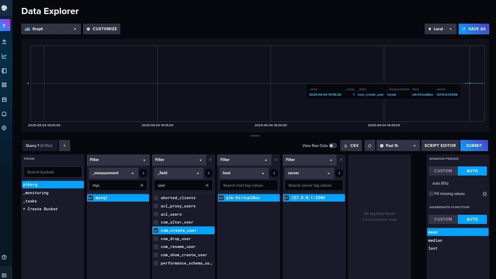
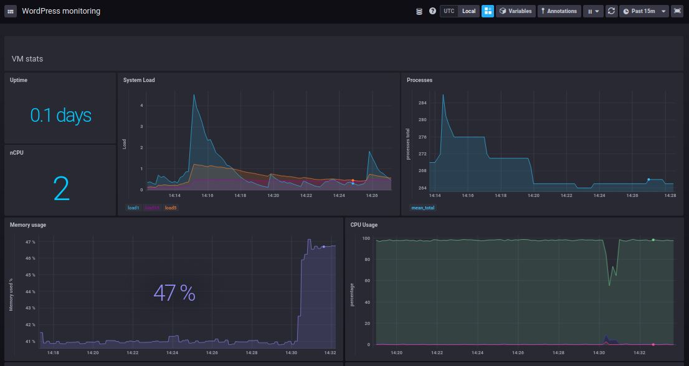
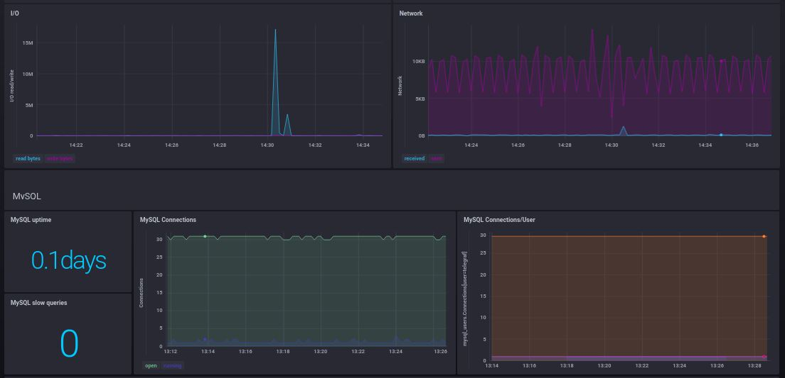
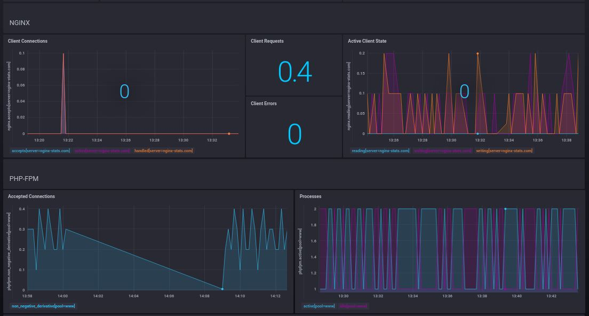
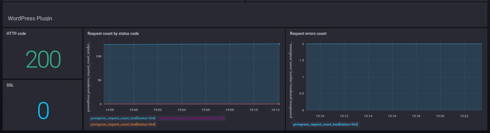

# Мониторинг с помощью TICK-стека

## Задача

Настроить сбор метрик с помощью TICK-стека на примере мониторинга CMS. Создать дашборд в Chronograf и настроить отправку уведомлений в Telegram через Kapacitor.

## Решение
Для решения задачи Telegraf установлены на одной машине с установленной ранее CMS, а InfluxDB, Chronograf и Kapacitor - на другой.

### Использованные элементы
| Элемент | Назначение |
| ------ | ------ |
| [InfluxDB](https://docs.influxdata.com/influxdb/v2/install/?t=Linux) | TSDB |
| [Telegraf](https://dl.influxdata.com/telegraf/releases/telegraf_1.34.1-1_amd64.deb) | агент для сбора метрик |
| [Chronograf](https://dl.influxdata.com/chronograf/releases/chronograf_1.10.7_amd64.deb) | инструмент визуализации данных |
| [Kapacitor](https://dl.influxdata.com/kapacitor/releases/kapacitor_1.7.7-1_amd64.deb) | инструмент алертинга |

##### 1. Установка Telegraf
Конфигурационный файл сформировал в UI после установки InfluxDB. В конфиг в том числе добавлен promethes-инпут - предосталяет метрики плагина, собирающего данные с Wordpress, таже в этот инпут включены blackbox-пробы по CMS. Файл приложен.

##### 2. Установка InfluxDB
Установлена версия 2.7.11, работает с дефолтными настройками (конфиг отсутствует). Базовые параметры для работы (учетная запись, организация, период хранения данных) установлены через influx setup.

##### 3. Установка Chronograf
Установлена версия 1.10.7, работает с дефолтными настройками. По показателям компонентов CMS и VM создан дашборд:

##### 4. Установка Kapacitor
Установлена версия 1.7.7, создан файл с алертами (использован вариант batch, так как отключены subscriptions, данные не отправляются напрямую в Kapacitor), конфигурационный файл Kapacitor содержит блок данных Telegram для отправки уведомлений. Файлы с правилами и конфигурацией Kapacitor приложены. Пример полученных уведомлений (настройка шаблонов уведомлений не производилась):

