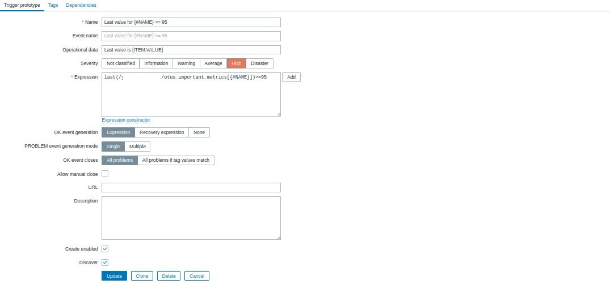
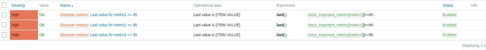
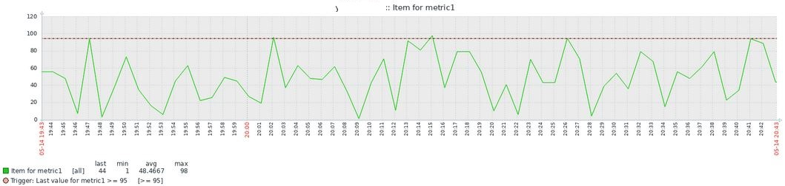

# Мониторинг с помощью Zabbix 

## Задача

Установить и сконфигурировать Zabbix для отправки алертов в Telegram-канал по результатам проверки значений метрик, сформированных скриптом.

## Решение
Скрипт генерирует метрики и сохраняет их в формате json для дальнейшего вычленения с помощью LLD-макросов. Скрип запускается по cron-у каждую минуту. Zabbix получает данные из файла с помощью правила обнаружения, затем, с использованием прототипов, формируются айтемы и триггеры. Триггер настроен на оповещения по заданному условию (>=95).

##### 1. Генерация метрик
Скрипт, генерирующий метрики, приложен. Ниже - внешний вид генерируемого скриптом json-а.

##### 2. Настройка обнаружения метрик в Zabbix
Метрики обнаружениваются автоматически через discovery rule. Айтемы и триггеры формируются по прототипам внутри discovery rule.

##### 3. Графики метрик

##### 4. Настройка уведомлений в Telegram
Создан пользователь, которому добавлен Telegram в медиа, в медиа-тип добавлен токен бота, создан экшн.

