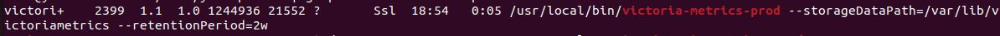
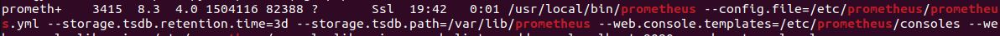
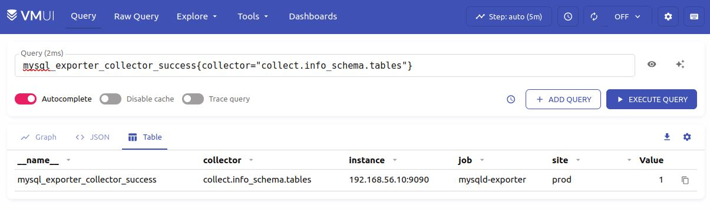

# Использование VictoriaMetrics в качестве хранилища для Prometheus

## Задача

Установить VictoriaMetrics, задать срок хранения метрик 2 недели. Установить для Prometheus меньший срок хранения метрик, настроить отправку метрик в VictoriaMetrics, задать лейбл среды prod.

## Решение
Приложен скорректированный в соответствии с новой задачей конфиг prometheus.yml.

##### 1. Установка VictoriaMetrics

##### 2. Корректировна срока хранения метрик в Prometheus

##### 3. Проверка доставки метрик в vmui

